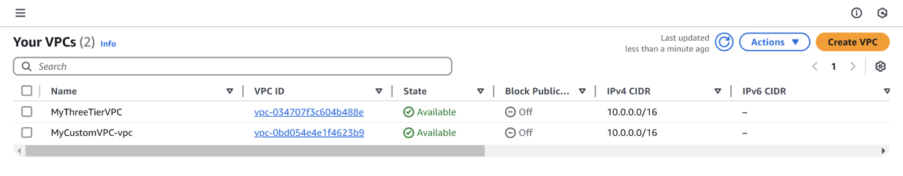
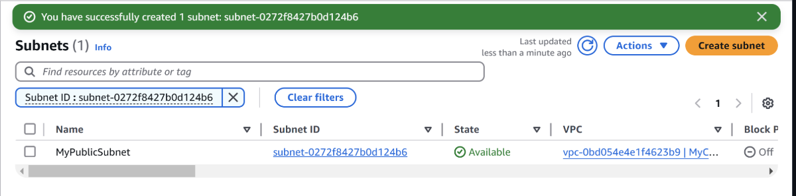
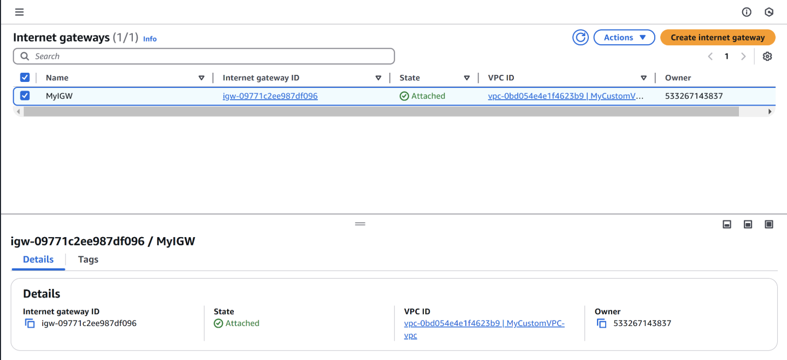
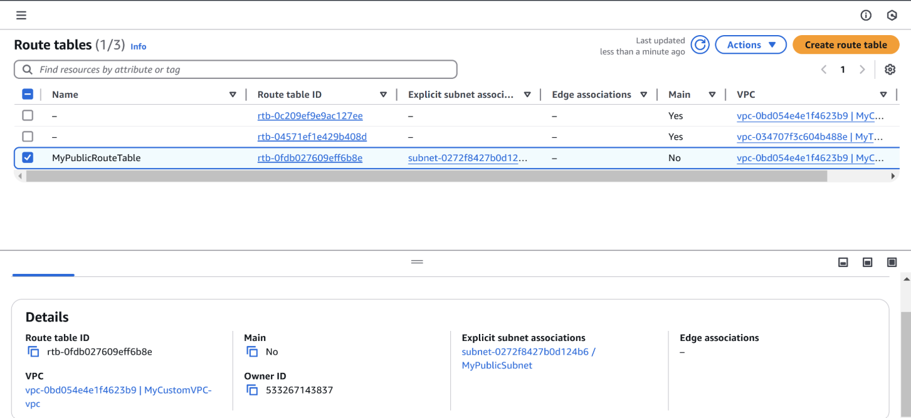
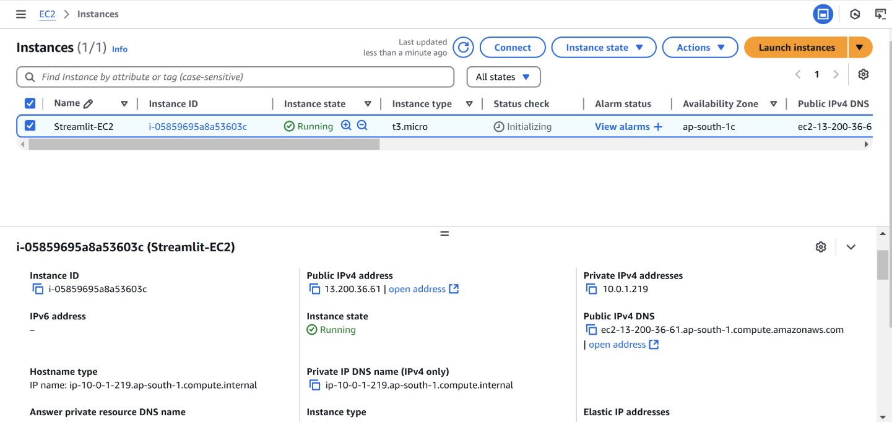
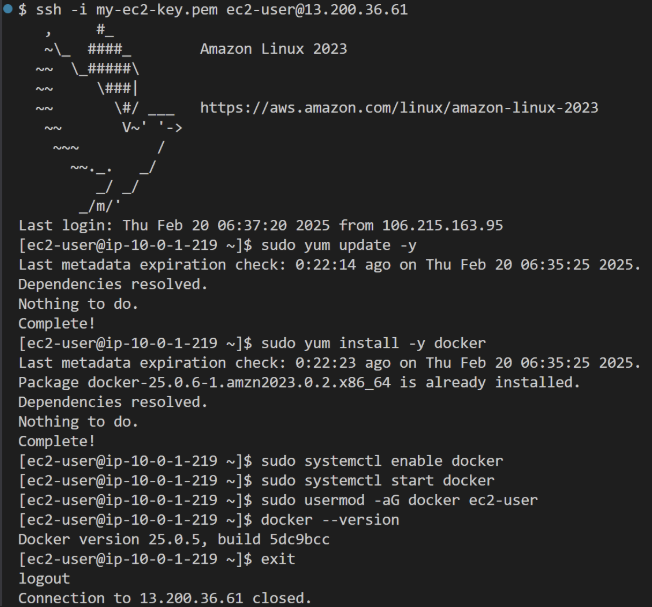
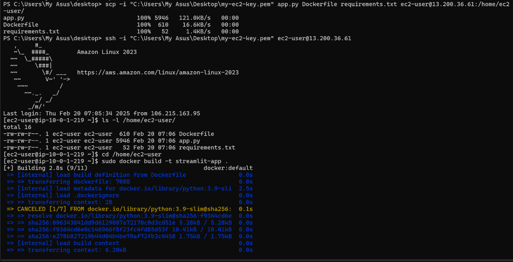
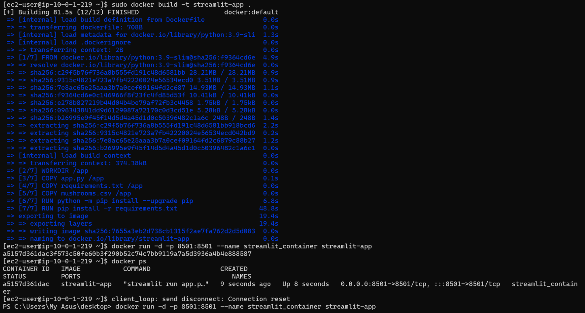
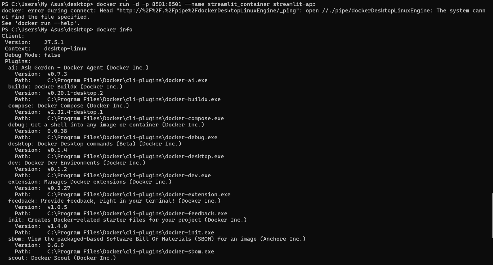
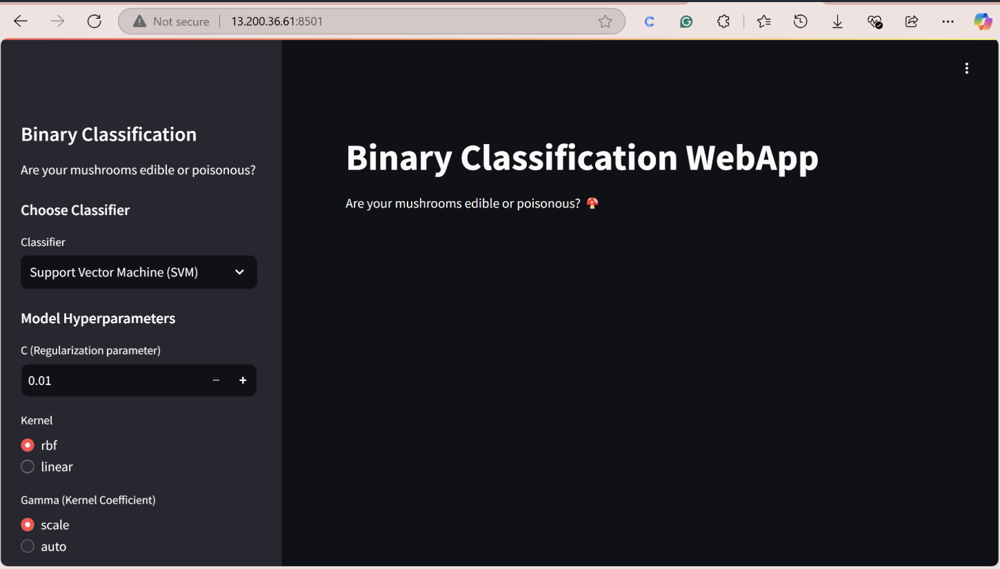

# Deploying a Streamlit App in Docker on AWS EC2


A hands-on DevOps project demonstrating how to deploy a Dockerized Streamlit Machine Learning application on an Amazon EC2 instance. The project covers AWS networking setup, Docker containerization, Linux server configuration, and cloud deployment.

---

# Table of Contents

- Project Overview
- Architecture
- Features
- Tech Stack
- AWS Infrastructure
- Project Structure
- Deployment Workflow
- Prerequisites
- Deployment Steps
- Screenshots
- Key Learnings
- Future Improvements
- License

---

# Project Overview

This project demonstrates the complete deployment lifecycle of a Streamlit application on AWS.

The deployment includes:

- Creating a custom VPC
- Creating a Public Subnet
- Configuring an Internet Gateway
- Configuring Route Tables
- Launching an Amazon EC2 instance
- Connecting through SSH
- Installing Docker
- Building a Docker image
- Running the Streamlit application inside a Docker container
- Accessing the application through the EC2 Public IP

---

# Architecture

```text
                  User
                    │
                    ▼
         Public IPv4 Address
                    │
                    ▼
        Amazon EC2 Instance
        (Amazon Linux 2023)
                    │
          Docker Engine
                    │
                    ▼
     Streamlit Docker Container
                    │
                    ▼
      Streamlit Machine Learning App
```

---

# Features

- Dockerized Streamlit application
- AWS EC2 deployment
- Amazon Linux 2023
- Custom AWS VPC
- Public Subnet configuration
- Internet Gateway configuration
- Route Table configuration
- Secure SSH access
- Docker container deployment
- Browser-accessible Streamlit application

---

# Tech Stack

| Technology | Purpose |
|------------|---------|
| Python | Application Development |
| Streamlit | Web Interface |
| Scikit-learn | Machine Learning |
| Pandas | Data Processing |
| Docker | Containerization |
| AWS EC2 | Cloud Compute |
| Amazon Linux 2023 | Operating System |
| AWS VPC | Networking |
| Git | Version Control |
| GitHub | Source Code Hosting |

---

# AWS Infrastructure

The following AWS resources were created manually for deployment:

- Custom VPC
- Public Subnet
- Internet Gateway
- Route Table
- Security Group
- Amazon EC2 (t3.micro)

---

# Project Structure

```text
streamlit-docker-aws-ec2/
│
├── README.md
├── LICENSE
├── .gitignore
├── Dockerfile
├── requirements.txt
├── app.py
├── mushrooms.csv
│
├── docs/
│   └── deployment-guide.md
│
└── screenshots/
    ├── vpc-created.png
    ├── subnet-created.png
    ├── internet-gateway.png
    ├── route-table.png
    ├── ec2-instance.png
    ├── ec2-connected.png
    ├── docker-installed.png
    ├── docker-build.png
    ├── container-running.png
    └── streamlit-app.png
```

---

# Deployment Workflow

```text
Create VPC
      │
      ▼
Create Public Subnet
      │
      ▼
Attach Internet Gateway
      │
      ▼
Configure Route Table
      │
      ▼
Launch EC2 Instance
      │
      ▼
SSH into EC2
      │
      ▼
Install Docker
      │
      ▼
Build Docker Image
      │
      ▼
Run Docker Container
      │
      ▼
Access Streamlit Application
```

---

# Prerequisites

- AWS Account
- Amazon EC2
- Docker
- SSH Client
- Git
- Python 3.9+

---

# Deployment Steps

### Clone Repository

```bash
git clone https://github.com/YOUR_USERNAME/streamlit-docker-aws-ec2.git

cd streamlit-docker-aws-ec2
```

### Connect to EC2

```bash
ssh -i my-ec2-key.pem ec2-user@<PUBLIC-IP>
```

### Build Docker Image

```bash
sudo docker build -t streamlit-app .
```

### Run Container

```bash
sudo docker run -d -p 8501:8501 --name streamlit-container streamlit-app
```

Open your browser:

```text
http://<EC2-PUBLIC-IP>:8501
```

---

# Screenshots

## 1️⃣ Custom VPC

Created a dedicated Virtual Private Cloud for the deployment.



---

## Public Subnet

Configured a public subnet inside the VPC.



---

##  Internet Gateway

Attached an Internet Gateway to provide internet connectivity.



---

##  Route Table

Configured routing between the subnet and the Internet Gateway.



---

##  EC2 Instance

Launched an Amazon Linux EC2 instance.



---

##  Connected to EC2

Successfully connected to the EC2 instance using SSH.



---

##  Docker Installation

Installed and configured Docker on Amazon Linux.



---

## Docker Image Build

Built the Docker image directly on the EC2 instance.



---

## Running Docker Container

Started the Streamlit container and verified that it was running.



---

## Streamlit Application

Successfully deployed and accessed the Streamlit application through the EC2 public IP.



---

# Key Learnings

Through this project I gained hands-on experience with:

- Docker image creation
- Docker container deployment
- AWS EC2 provisioning
- Amazon VPC networking
- Public Subnet configuration
- Internet Gateway attachment
- Route Table configuration
- Linux server administration
- SSH connectivity
- Cloud application deployment

---

# Future Improvements

- Automate infrastructure using Terraform
- Add GitHub Actions CI/CD
- Push Docker images to Docker Hub or Amazon ECR
- Deploy using Amazon ECS or EKS
- Configure an NGINX reverse proxy
- Add HTTPS with SSL/TLS
- Integrate CloudWatch monitoring
- Use an Application Load Balancer
- Deploy in a Multi-AZ architecture

---

# Author

Tanmay Singh
